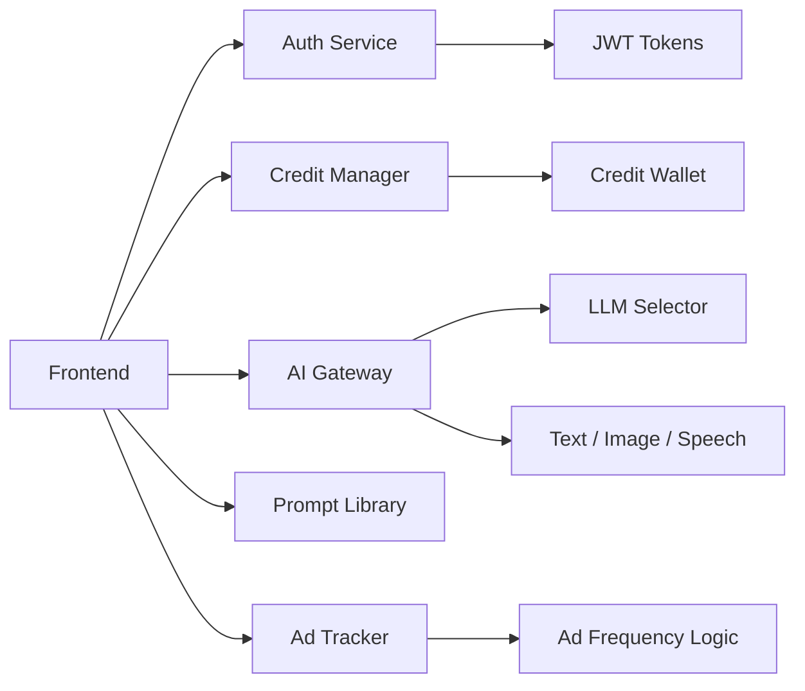
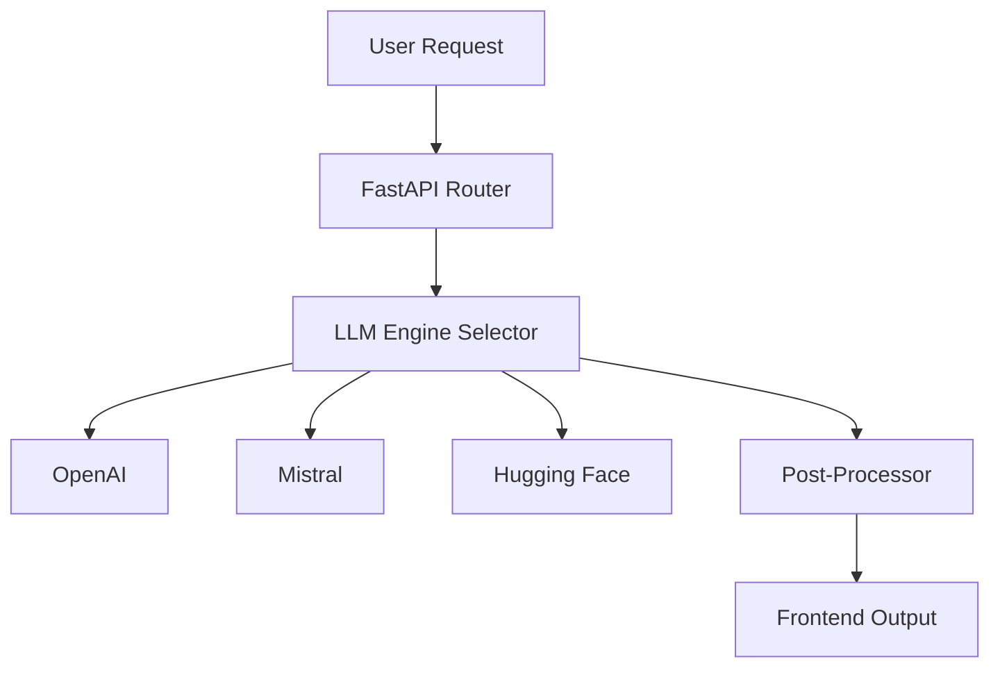
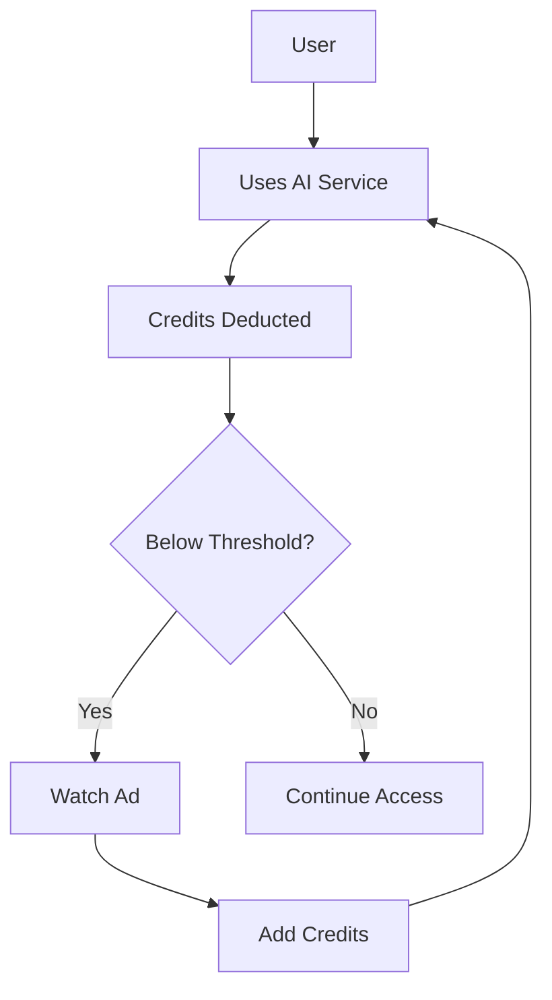
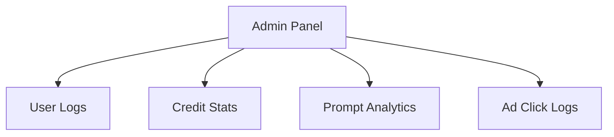

# ✨ MagicAI — Your One-Stop Generative AI Platform ✨

<p align="center">
  
  
  
  
</p>

<p align="center">
  <strong>All-in-one credit-based AI utility platform integrating text, image, audio, and video capabilities with monetization and marketplace support.</strong>
</p>

---

## 📑 Table of Contents
- [🚀 Project Overview](#-project-overview)
- [📦 Features](#-features)
- [🧠 System Architecture](#-system-architecture)
- [🛠️ Tech Stack](#️-tech-stack)
- [🧪 Modules Included](#-modules-included)
- [📸 Screenshots](#-screenshots)
- [🛠️ Setup Instructions](#-setup-instructions)
- [📬 Contact](#-contact)

---

## 🚀 Project Overview
**MagicAI** is a scalable, modular generative-AI platform that:

- Delivers multiple AI capabilities (Text, Image, Audio, & more)
- Integrates with several LLM providers (OpenAI, Hugging Face, Mistral, DeepSeek)
- Controls usage via a credit wallet
- Monetizes through ad-based refills and prompt sharing
- Hosts a prompt marketplace and admin analytics

---

## 📦 Features
| Category | Highlights |
|----------|------------|
| 🧠 **AI-as-a-Service** | Text, image & audio generation with multi-LLM fallback |
| 🧾 **Prompt Marketplace** | Curated & user-shared prompts (earn on reuse) |
| 📺 **Ad Monetization** | Watch ads → earn credits; share prompts → bonus credits |
| 🛂 **Auth + Credits** | JWT-secured login & credit wallet |
| 📊 **Admin Panel** | Usage metrics, ad clicks, credit stats |

---

## 🧠 System Architecture
## 🧠 System Architecture

### 🌐 High-Level Architecture
```mermaid
graph TD
  A[User (Web/App)] --> B[Frontend (Streamlit / React)]
  B --> C[Backend API - FastAPI]
  C --> D[LLM APIs (OpenAI, HF, etc.)]
  C --> E[Redis Cache]
  C --> F[Database (PostgreSQL / DynamoDB)]
  C --> G[Prompt Marketplace]
  C --> H[Ad Engine]
```

### 🧩 Modular Services Flow



### 🧠 AI Pipeline (Text | Image | Audio)


### 💳 Credit Usage + Ad Monetization


### 🛡️ Admin Dashboard Flow


---

## 🛠️ Tech Stack
| Layer          | Tools / Frameworks                               |
|----------------|--------------------------------------------------|
| **Frontend**   | Streamlit, React, Tailwind CSS                   |
| **Backend**    | FastAPI (Python)                                 |
| **AI Providers**| OpenAI, Mistral, Hugging Face, DeepSeek         |
| **Database**   | DynamoDB or PostgreSQL                           |
| **Caching**    | Redis                                            |
| **Queue (opt.)**| Celery + RabbitMQ / Redis                       |
| **Storage**    | S3 or GCS (assets, generated media)              |
| **Auth**       | JWT / OAuth2                                     |
| **Deployment** | Docker, Kubernetes (optional), AWS / GCP         |

---

## 🧪 Modules Included
| Module        | Purpose                                      |
|---------------|----------------------------------------------|
| `auth/`       | JWT login, signup, refresh                   |
| `credits/`    | Wallet, ad-based refills, usage tracking     |
| `chat/`       | Multi-provider conversational AI             |
| `images/`     | Prompt-to-image generation                   |
| `speech/`     | TTS + STT services                           |
| `prompts/`    | Marketplace: upload, rate, reuse             |
| `ads/`        | Ad fetching, click & frequency logging       |
| `admin/`      | Analytics dashboard                          |

---

## 📸 Screenshots
*(Add real screenshots or replace these placeholders)*

- `📷 Chat Interface`
- `📷 Image Generator`
- `📷 Credit Wallet & Ad Modal`
- `📷 Admin Analytics Dashboard`

---

## 🛠️ Setup Instructions

```bash
# 1️⃣  Clone the repository
git clone https://github.com/yourusername/magicai.git
cd magicai

# 2️⃣  Install backend dependencies
pip install -r requirements.txt

# 3️⃣  Run FastAPI backend
uvicorn app.main:app --reload

# 4️⃣  Launch Streamlit frontend
streamlit run streamlit_app.py

# 5️⃣  (Optional) React frontend
cd frontend
npm install
npm start
```

---

## 📬 Contact
- 📧 **Email:** [ndutta25@gmail.com](mailto:ndutta25@gmail.com)  
- 💼 **LinkedIn:** [Nandan Dutta](https://www.linkedin.com/in/nandan-dutta-7b26b736/)

---

## 📄 License
Licensed under the **MIT License** — feel free to fork, adapt, and build on it!

---

> _“Gamify AI. Monetize Intelligence. Build the Future.”_ 🚀
